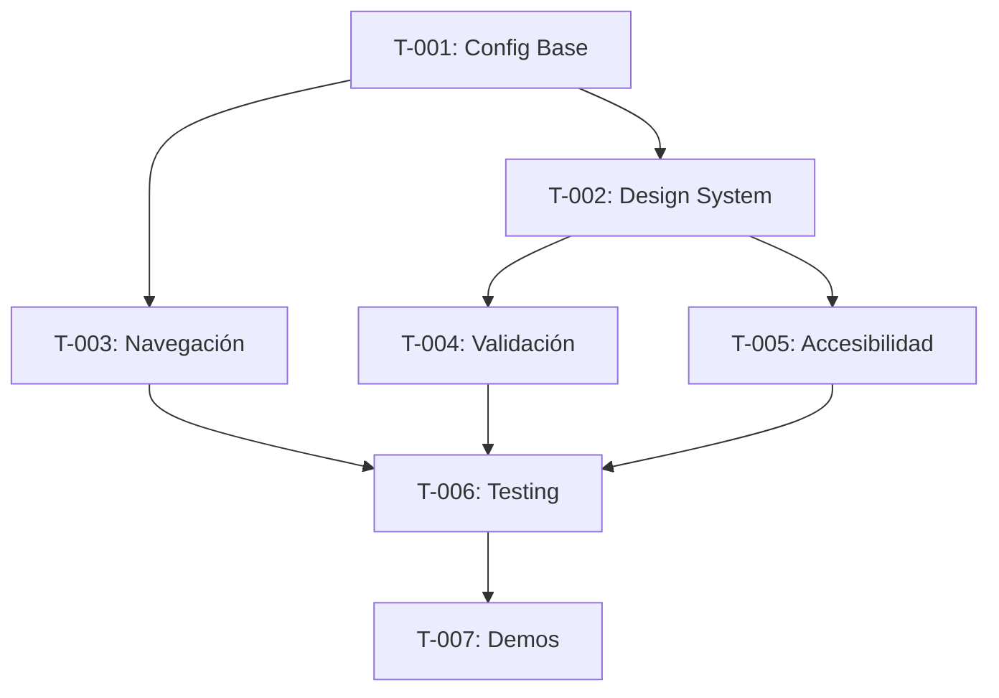

# MVP-02 — UI base y navegación (Android)

## Historias de usuario
- Como usuario, quiero navegar desde Login a Home tras validación local.
- Como usuario, quiero ver un tema consistente (Material 3, claro/oscuro).

## Criterios de aceptación
- `NavHost` con rutas tipadas (`login`, `home`).
- Validación básica en formulario (email requerido, password ≥ 6).
- Soporte de tema claro/oscuro y a11y mínima (contentDescription).

## Entregables
- Pantallas `LoginScreen`, `HomeScreen` en Compose.
- `Theme.kt` con esquema Material 3.

## Estimación
- 5 puntos. 1 día.

## DoR
- Reglas de validación aprobadas.

## DoD
- UI tests de navegación y validación.

## Comandos
- `./gradlew :app:connectedDebugAndroidTest`

## Código de ejemplo
```kotlin
@Composable fun AppNav() {
  val nav = rememberNavController()
  NavHost(nav, startDestination = "login") {
    composable("login") { Login { nav.navigate("home") } }
    composable("home") { Home() }
  }
}
```

## ADRs
- Ver decisiones del sprint en `./ADRs/`.
## Gherkin (ejemplos)
```gherkin
Feature: Navegación básica
  Scenario: Login exitoso
    Given que ingreso email y contraseña válidos
    When toco el botón Ingresar
    Then navego a Home
    And el botón Ingresar queda deshabilitado durante el envío
```

## DoR extendido
- Reglas de validación acordadas (email, longitud mínima).
- Paleta de colores y tipografía definidas.

## DoD extendido
- Pruebas UI cubren navegación y estados de error.
- A11y básica verificada (labels, contentDescription, tamaños táctiles).

# Tareas MVP-02: UI Framework y Navegación

## Sprint Planning
**Duración estimada**: 2 semanas  
**Prioridad**: Alta (Bloqueante para features posteriores)  
**Equipo**: 2-3 desarrolladores Android

---

## 📋 Task Breakdown

### 🏗️ T-001: Configuración Base de Compose
**Estimación**: 1 día  
**Asignado a**: Senior Android Developer  
**Prioridad**: Crítica

#### Subtareas:
- [ ] Actualizar `build.gradle.kts` (app) con dependencias Compose BOM
- [ ] Configurar `compileOptions` y `kotlinCompilerExtensionVersion`
- [ ] Habilitar `buildFeatures.compose = true`
- [ ] Agregar dependencias de testing para Compose
- [ ] Configurar ProGuard rules para Compose
- [ ] Verificar compatibilidad con Android 14 (API 34)

#### Criterios de Aceptación:
- [ ] Proyecto compila sin errores con Compose
- [ ] Preview functions funcionan correctamente
- [ ] Tests de instrumentación ejecutan sin problemas

#### Definición de Terminado:
- [ ] Code review aprobado
- [ ] Tests pasando en CI
- [ ] Documentación actualizada

---

### 🎨 T-002: Implementar Design System Base
**Estimación**: 3 días  
**Asignado a**: UI/UX Developer + Android Developer  
**Prioridad**: Alta

#### Subtareas:
- [ ] Crear módulo `:core:ui` con estructura base
- [ ] Implementar `Color.kt` con paleta Material 3
- [ ] Configurar `Type.kt` con tipografías estándar
- [ ] Crear `Theme.kt` con soporte light/dark + dynamic color
- [ ] Implementar `Dimension.kt` con espaciados consistentes
- [ ] Crear componentes base: Button, Card, TextField
- [ ] Agregar iconografía base (Material Icons)

#### Criterios de Aceptación:
- [ ] Theme funciona en light/dark mode
- [ ] Dynamic Color activo en Android 12+
- [ ] Componentes siguen Material 3 guidelines
- [ ] Preview functions para todos los componentes
- [ ] Accesibilidad básica implementada

#### Definición de Terminado:
- [ ] Design review aprobado por UX
- [ ] Accessibility audit passed
- [ ] Component library documentada

---

### 🧭 T-003: Sistema de Navegación Tipada
**Estimación**: 2 días  
**Asignado a**: Senior Android Developer  
**Prioridad**: Alta

#### Subtareas:
- [ ] Configurar Navigation Compose
- [ ] Implementar `NavigationRoutes.kt` con sealed classes serializables
- [ ] Crear `AppNavigation.kt` con NavHost principal
- [ ] Implementar navegación type-safe con parámetros
- [ ] Configurar deep linking básico
- [ ] Manejar back stack correctamente
- [ ] Implementar navigation testing

#### Criterios de Aceptación:
- [ ] Navegación entre pantallas funciona correctamente
- [ ] Parámetros se pasan de forma type-safe
- [ ] Back button behaviour es correcto
- [ ] Deep links funcionan para rutas principales
- [ ] Tests de navegación pasando

#### Definición de Terminado:
- [ ] Navigation flow completo implementado
- [ ] Tests de integración pasando
- [ ] Documentación de rutas actualizada

---

### ✅ T-004: Sistema de Validación de Formularios
**Estimación**: 2 días  
**Asignado a**: Android Developer  
**Prioridad**: Media

#### Subtareas:
- [ ] Crear interfaces `Validator<T>` y `ValidationResult`
- [ ] Implementar validadores comunes (email, password, required)
- [ ] Crear `ValidatedTextField` component
- [ ] Implementar validación en tiempo real
- [ ] Manejar estados de error visual
- [ ] Integrar con accessibility (screen readers)
- [ ] Crear tests para validadores

#### Criterios de Aceptación:
- [ ] Validación funciona en tiempo real
- [ ] Errores se muestran visualmente
- [ ] Mensajes de error son accesibles
- [ ] Validadores son reutilizables
- [ ] Performance no se ve afectada

#### Definición de Terminado:
- [ ] Formulario demo implementado
- [ ] Tests unitarios para validadores
- [ ] Accessibility testing completo

---

### ♿ T-005: Implementación de Accesibilidad
**Estimación**: 2 días  
**Asignado a**: Android Developer + QA  
**Prioridad**: Media

#### Subtareas:
- [ ] Agregar `contentDescription` a todos los elementos
- [ ] Implementar `semantics` properties apropiadas
- [ ] Configurar `Role` para elementos interactivos
- [ ] Verificar touch targets mínimos (48dp)
- [ ] Crear `AccessibilityExtensions.kt` helpers
- [ ] Implementar navegación por teclado
- [ ] Configurar tests de accesibilidad

#### Criterios de Aceptación:
- [ ] TalkBack funciona correctamente en todas las pantallas
- [ ] Switch Access navigation disponible
- [ ] Touch targets cumplen guidelines de Android
- [ ] Contrast ratio cumple WCAG AA standards
- [ ] Tests de accesibilidad automáticos pasando

#### Definición de Terminado:
- [ ] Accessibility Scanner score ≥ 95%
- [ ] Manual testing con TalkBack aprobado
- [ ] Accessibility guidelines documentadas

---

### 🧪 T-006: Testing Suite de UI
**Estimación**: 2 días  
**Asignado a**: Android Developer + QA  
**Prioridad**: Media

#### Subtareas:
- [ ] Configurar Compose Testing framework
- [ ] Crear tests para componentes base
- [ ] Implementar screenshot testing
- [ ] Crear tests de navegación
- [ ] Tests de accesibilidad automatizados
- [ ] Performance testing básico
- [ ] Configurar tests en CI pipeline

#### Criterios de Aceptación:
- [ ] Cobertura de tests ≥ 80%
- [ ] Screenshot tests detectan regresiones visuales
- [ ] Navigation tests cubren flows principales
- [ ] Accessibility tests automáticos
- [ ] Tests ejecutan en CI sin fallos

#### Definición de Terminado:
- [ ] Test suite completa implementada
- [ ] CI pipeline configurado correctamente
- [ ] Documentation de testing actualizada

---

### 📱 T-007: Pantallas Demo y Showcase
**Estimación**: 1 día  
**Asignado a**: Android Developer  
**Prioridad**: Baja

#### Subtareas:
- [ ] Crear `HomeScreen` con navegación básica
- [ ] Implementar `ComponentShowcaseScreen`
- [ ] Crear `FormValidationDemoScreen`
- [ ] Agregar `ThemeToggleScreen`
- [ ] Implementar navigation entre demos
- [ ] Documentar uso de componentes

#### Criterios de Aceptación:
- [ ] Todas las features del MVP-02 están demonstradas
- [ ] Navegación entre demos funciona
- [ ] Ejemplos de uso están documentados
- [ ] Preview functions disponibles

#### Definición de Terminado:
- [ ] Demo app funcional
- [ ] Screenshots para documentación
- [ ] Guía de uso actualizada

---

## 🔗 Dependencias entre Tareas



## 📊 Métricas de Progreso

### Definición of Done Checklist
- [ ] Todas las tareas completadas y testeadas
- [ ] Code review aprobado por al menos 2 reviewers
- [ ] Tests automáticos pasando (unit + UI + accessibility)
- [ ] Performance benchmarks cumplidos
- [ ] Documentación actualizada
- [ ] Demo app funcional
- [ ] Accessibility audit aprobado

### KPIs del Sprint
| Métrica | Target | Método de Medición |
|---------|--------|--------------------|
| Cobertura de Tests | ≥ 80% | JaCoCo reports |
| Lint Warnings | 0 críticos | Detekt analysis |
| Accessibility Score | ≥ 95% | Accessibility Scanner |
| Build Time | < 2min | CI pipeline metrics |
| APK Size | < 10MB | Build artifacts |

## 🚨 Riesgos y Contingencias

### Riesgo Alto: Complejidad de Navigation Compose
**Probabilidad**: Media  
**Impacto**: Alto  
**Mitigación**: 
- Comenzar con navegación simple, agregar complejidad gradualmente
- Tener fallback plan con Fragment-based navigation si es necesario
- Consultar con equipo de arquitectura temprano

### Riesgo Medio: Performance de Compose
**Probabilidad**: Baja  
**Impacto**: Medio  
**Mitigación**:
- Hacer profiling temprano en desarrollo
- Usar Compose Performance guidelines
- Implementar lazy loading donde sea apropiado

### Riesgo Bajo: Curva de aprendizaje del equipo
**Probabilidad**: Media  
**Impacto**: Bajo  
**Mitigación**:
- Training sessions para Compose
- Pair programming entre senior/junior developers
- Documentación y ejemplos internos

## 📝 Notas de Implementación

### Estándares de Código
- Todo el código debe estar en inglés
- Usar `stringResource()` para todos los textos
- Seguir naming conventions de Android/Kotlin
- Implementar previews para todos los @Composable
- Documentar funciones públicas con KDoc

### Performance Considerations
- Evitar recomposiciones innecesarias
- Usar `derivedStateOf` para cálculos complejos
- Implementar `key()` en lazy lists
- Optimizar imágenes y assets

### Accessibility Checklist
- Content descriptions para elementos no textuales
- Semantic properties apropiadas
- Touch targets de al menos 48dp
- Soporte para high contrast y large text
- Testing con TalkBack y Switch Access
