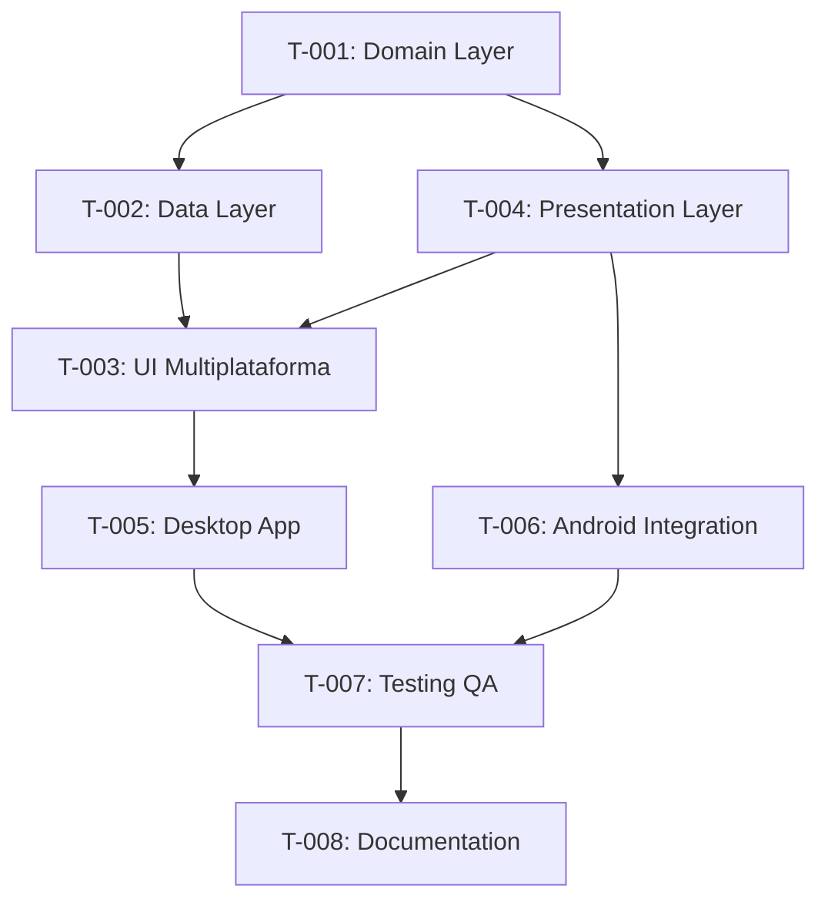

# MVP-03.6 — Migración de Funcionalidades a Shared (KMP)

## Sprint Planning
**Duración estimada**: 2-3 semanas  
**Prioridad**: CRÍTICA (Convierte demo KMP en aplicaciones reales)  
**Equipo**: 2-3 desarrolladores KMP + 1 QA

---

## 📋 Task Breakdown

### 🏗️ T-001: Migración de Domain Layer (MVP-01 Fundamentos)
**Estimación**: 3 días  
**Asignado a**: Senior KMP Developer  
**Prioridad**: Crítica

#### Subtareas:
- [ ] Crear estructura `shared/src/commonMain/domain/`
- [ ] Migrar casos de uso de Android a `commonMain`
- [ ] Implementar interfaces de repositorio en `commonMain`
- [ ] Configurar DI (Koin) para casos de uso compartidos
- [ ] Migrar `BuildConfig` → `SharedConfig` multiplataforma
- [ ] Adaptar configuración de flavors para shared
- [ ] Tests unitarios para casos de uso migrados

#### Criterios de Aceptación:
- [ ] Casos de uso funcionan idénticamente en Android
- [ ] Shared module expone misma API que antes
- [ ] Tests unitarios ≥ 85% cobertura en domain layer
- [ ] Configuration management funcional multiplataforma

#### Definición de Terminado:
- [ ] Android app mantiene funcionalidad sin regresiones
- [ ] Shared domain layer compilar para Android y Desktop
- [ ] Tests pasando en ambos targets

---

### 🗂️ T-002: Migración de Data Layer (MVP-03 Storage)
**Estimación**: 4 días  
**Asignado a**: KMP Developer + Android Developer  
**Prioridad**: Alta

#### Subtareas:
- [ ] Migrar `PreferencesRepository` de DataStore a KeyValueStore
- [ ] Implementar `SecureStorage` multiplataforma
- [ ] Crear repositorios compartidos en `commonMain`
- [ ] Migrar modelos de datos a `commonMain`
- [ ] Implementar cache y persistencia multiplataforma
- [ ] Configurar migraciones de datos existentes
- [ ] Tests de integración para data layer

#### Criterios de Aceptación:
- [ ] Preferencias sincronizadas entre Android y Desktop
- [ ] Almacenamiento seguro funcional en ambas plataformas
- [ ] Migración automática de datos Android existentes
- [ ] Performance equivalente a implementación Android-only
- [ ] Tests de persistencia pasando

#### Definición de Terminado:
- [ ] DataStore completamente reemplazado por KeyValueStore
- [ ] SecureStorage funcional en Android y Desktop
- [ ] Migración de datos existentes verificada

---

### 🎨 T-003: UI Multiplataforma (MVP-02 UI Framework)
**Estimación**: 5 días  
**Asignado a**: UI Developer + KMP Developer  
**Prioridad**: Alta

#### Subtareas:
- [ ] Migrar Design System a Compose Multiplatform
- [ ] Crear componentes UI compartidos para Desktop
- [ ] Implementar navegación tipada en Desktop
- [ ] Migrar validación de formularios a shared
- [ ] Adaptar theming (light/dark) para Desktop
- [ ] Configurar accesibilidad básica en Desktop
- [ ] Tests de UI para componentes compartidos

#### Criterios de Aceptación:
- [ ] Design System idéntico en Android y Desktop
- [ ] Navegación funcional y tipada en Desktop
- [ ] Validación de formularios compartida
- [ ] Theming consistente entre plataformas
- [ ] Componentes UI reutilizables ≥ 80%

#### Definición de Terminado:
- [ ] Desktop UI visualmente similar a Android
- [ ] Navegación completa implementada
- [ ] Tests de UI pasando en ambas plataformas

---

### 📱 T-004: Migración de Presentation Layer
**Estimación**: 3 días  
**Asignado a**: Senior Android Developer  
**Prioridad**: Alta

#### Subtareas:
- [ ] Migrar ViewModels a `commonMain`
- [ ] Implementar state management compartido
- [ ] Crear abstracciones de UI state
- [ ] Migrar lógica de navegación a shared
- [ ] Implementar event handling compartido
- [ ] Configurar lifecycle management multiplataforma
- [ ] Tests para ViewModels compartidos

#### Criterios de Aceptación:
- [ ] ViewModels funcionan idénticamente en ambas plataformas
- [ ] State management consistente
- [ ] Navegación centralizada y tipada
- [ ] Event handling sin duplicación de código
- [ ] Lifecycle management correcto

#### Definición de Terminado:
- [ ] Presentation layer 100% compartido
- [ ] ViewModels testeados en Android y Desktop
- [ ] State synchronization verificada

---

### 🖥️ T-005: Desktop App Completa
**Estimación**: 4 días  
**Asignado a**: UI Developer + KMP Developer  
**Prioridad**: Media

#### Subtareas:
- [ ] Implementar pantallas principales en Desktop
- [ ] Configurar navegación completa Desktop
- [ ] Integrar formularios funcionales
- [ ] Implementar preferencias UI en Desktop
- [ ] Configurar menu y shortcuts Desktop
- [ ] Optimizar performance para Desktop
- [ ] Testing funcional Desktop app

#### Criterios de Aceptación:
- [ ] Desktop app tiene funcionalidad equivalente a Android
- [ ] Navegación entre pantallas fluida
- [ ] Formularios con validación funcional
- [ ] Preferencias persistentes
- [ ] Performance aceptable (UI responsive)

#### Definición de Terminado:
- [ ] Desktop app completamente funcional
- [ ] Feature parity con Android app
- [ ] UX optimizada para Desktop

---

### 🔧 T-006: Android App Integration  
**Estimación**: 2 días  
**Asignado a**: Android Developer  
**Prioridad**: Media

#### Subtareas:
- [ ] Refactorizar Android app para usar shared module
- [ ] Eliminar código duplicado en Android
- [ ] Optimizar integration points
- [ ] Verificar todas las funcionalidades existentes
- [ ] Actualizar dependency injection
- [ ] Performance testing Android
- [ ] Regression testing completo

#### Criterios de Aceptación:
- [ ] Android app mantiene 100% funcionalidad original
- [ ] Performance igual o mejor que antes
- [ ] Código duplicado reducido ≥ 70%
- [ ] Integration seamless con shared module
- [ ] Tests de regresión pasando

#### Definición de Terminado:
- [ ] Android app usando shared sin regresiones
- [ ] Performance benchmarks cumplidos
- [ ] QA approval para funcionalidad existente

---

### ✅ T-007: Testing y QA Multiplataforma
**Estimación**: 3 días  
**Asignado a**: QA Engineer + Developer  
**Prioridad**: Alta

#### Subtareas:
- [ ] Tests de integración multiplataforma
- [ ] Verificación funcional Android vs Desktop
- [ ] Performance testing comparativo
- [ ] Accessibility testing Desktop
- [ ] User journey testing completo
- [ ] Load testing para shared services
- [ ] Automated testing pipeline

#### Criterios de Aceptación:
- [ ] Feature parity verificado entre plataformas
- [ ] Performance dentro de SLA definidos
- [ ] Accessibility compliance Desktop
- [ ] User journeys completados sin issues
- [ ] Tests automatizados ≥ 85% cobertura

#### Definición de Terminado:
- [ ] QA sign-off para ambas plataformas
- [ ] Automated testing pipeline funcionando
- [ ] Performance benchmarks documentados

---

### 📚 T-008: Documentación y Deploy
**Estimación**: 1 día  
**Asignado a**: Tech Lead  
**Prioridad**: Baja

#### Subtareas:
- [ ] Documentar arquitectura final KMP
- [ ] Crear guías de desarrollo multiplataforma  
- [ ] Actualizar README principal
- [ ] Documentar build y deploy process
- [ ] Crear troubleshooting guide
- [ ] Documentar performance guidelines
- [ ] Crear release notes

#### Criterios de Aceptación:
- [ ] Documentación completa y actualizada
- [ ] Guías de desarrollo claras
- [ ] Build process documentado
- [ ] Troubleshooting guide útil
- [ ] Release notes detalladas

#### Definición de Terminado:
- [ ] Documentación reviewed y approved
- [ ] Team training materials ready
- [ ] MVP-03.6 oficialmente released

---

## 🔗 Dependencias entre Tareas

## 📊 Métricas de Progreso

### Definition of Done Checklist
- [ ] Todas las tareas completadas y testeadas
- [ ] Code review aprobado por al menos 2 reviewers senior  
- [ ] Tests automatizados ≥ 85% cobertura shared module
- [ ] Performance benchmarks cumplidos
- [ ] QA approval para ambas plataformas
- [ ] Feature parity verificado Android/Desktop
- [ ] Documentación completa actualizada
- [ ] No regresiones en funcionalidad existente

### KPIs del Sprint
| Métrica | Target | Método de Medición |
|---------|--------|--------------------|
| Feature Parity | 100% | Manual QA testing |
| Cobertura Tests Shared | ≥ 85% | JaCoCo reports |
| Performance Android | Sin degradación | Benchmark comparison |
| Performance Desktop | UI responsive (<100ms) | Performance profiling |
| Code Duplication Reduction | ≥ 70% | Static analysis |
| Build Success Rate | 100% | CI pipeline metrics |

## 🚨 Riesgos y Contingencias

### Riesgo Crítico: Complejidad de migración masiva
**Probabilidad**: Alta  
**Impacto**: Crítico  
**Mitigación**: 
- Migración incremental por layers
- Feature flags para rollback rápido
- Ambiente de staging dedicado para testing
- Daily standups para detección temprana de issues

### Riesgo Alto: Performance degradation
**Probabilidad**: Media  
**Impacto**: Alto  
**Mitigación**:
- Benchmarking continuo durante desarrollo
- Performance profiling en cada milestone
- Optimización específica por plataforma cuando sea necesario

### Riesgo Medio: Diferencias UX Android/Desktop
**Probabilidad**: Media  
**Impacto**: Medio  
**Mitigación**:
- Design review específico para Desktop
- User testing en ambas plataformas
- UX adjustments específicos cuando sea necesario

## 📝 Notas de Implementación

### Estándares de Migración
- Mantener API contracts existentes
- Zero breaking changes para Android app
- Shared-first approach: maximizar código compartido
- Platform-specific optimizations solo cuando sea necesario
- Comprehensive testing en cada step

### Success Criteria
- Android app mantiene 100% funcionalidad sin regresiones
- Desktop app logra ≥ 90% feature parity con Android
- Performance Android igual o mejor que baseline
- Performance Desktop acceptable para uso diario  
- Codebase reduction ≥ 70% duplicación eliminada

---

**🎯 Objetivo del Sprint**: Convertir el foundation KMP en aplicaciones reales multiplataforma
**📈 Success Metric**: Two fully functional apps (Android + Desktop) sharing 85%+ business logic
**⚡ Critical Path**: T-001 → T-002 → T-004 → T-003 → T-005/T-006 → T-007

*Este sprint es el punto de inflexión entre "KMP demo" y "aplicaciones reales multiplataforma".*